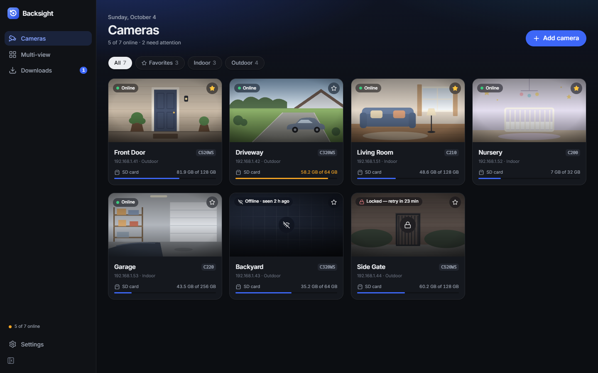
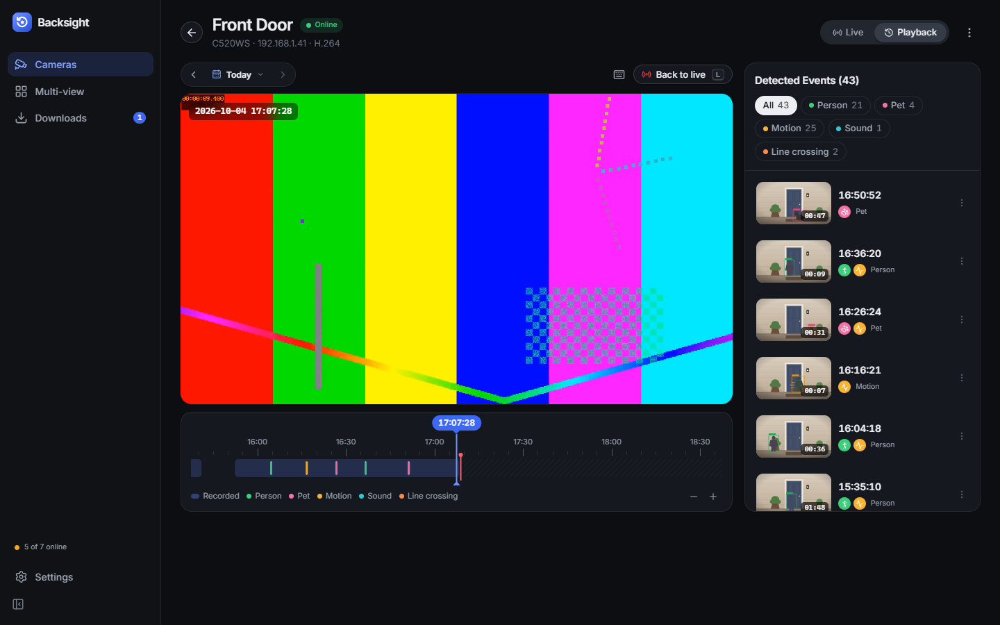
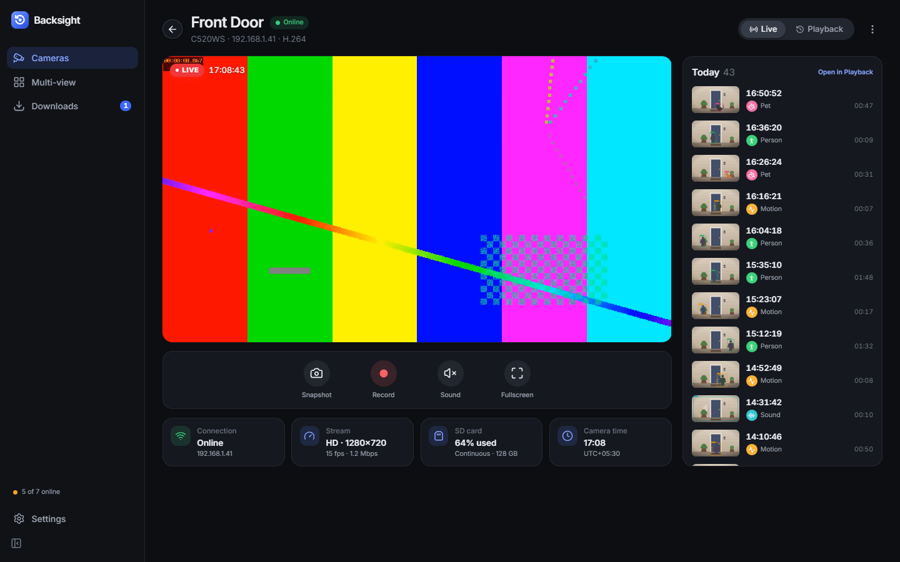

# Backsight

**A desktop viewer for Tapo and Qubo cameras**: live view, Tapo SD-card playback on a timeline, detection
events, clip export and a multi-camera grid, on Windows, macOS and Linux.

TP-Link's Tapo app only lets you browse a camera's SD-card recordings on a phone. Backsight
brings that to the desktop. Tapo connections stay on your local network. Qubo live view uses
the owner's Qubo account and the vendor's cloud relay.

> **Status:** early, but working end to end on Windows with Tapo C325WB cameras (firmware
> 1.2.6 and 1.4.4). Other models on the same firmware generation should work; reports welcome.



<sub>All screenshots here come from the built-in demo cameras (`npm run dev`), not real
footage — so the video is an ffmpeg test pattern.</sub>

## Features

- **Live view** from the camera's own media stream: HD or SD, starts in about 0.1 s, with
  snapshots, fullscreen and live stats.
- **SD-card playback** on a zoomable timeline with a calendar of days that have footage,
  speeds from 0.5× to 16× (above ~7× it's limited by how fast the camera can send) and
  keyboard shortcuts.
- **Detection events** (person, vehicle, pet, motion…) with the camera's own thumbnails and
  filters, straight from the SD card.
- **Clip & download** to MP4 (H.264/H.265) at up to ~7× real time, with AAC audio on Windows
  (other platforms export video only for now).
- **Multi-view** grid (1, 2, 4, 1+5, 9 or 16 cameras).
- **Qubo live view** through its signed RTSPS cloud relay, with automatic token renewal.
  Verified with the Smart Cam 360 3MP at 2304×1296 (H.265), with AAC audio decoded to PCM.
  Qubo SD-card playback, events and SD-card exports are not supported yet.
- **Camera cards** with a recent picture of each camera, grabbed in the background and
  refreshed while you watch.
- Passwords and Qubo session tokens stay in your OS keychain. Tapo camera certificates
  are pinned on first use; Qubo HTTPS and RTSPS use normal public-certificate validation.

**Playback** puts the day on a zoomable timeline — the recorded band, colour-coded detection
events, and the event list beside it:



**Live view** has the stream controls and what the camera reports about itself:



Not yet: pan/tilt control, two-way audio, hubs and battery cameras, and cameras whose firmware
only offers TP-Link's newer "TPAP" login.

## Requirements

- Tapo cameras reachable on your LAN, with an SD card for recordings.
- **Third-Party Compatibility** turned on in the Tapo app (Me → Third-Party Services).
- The TP-Link account password of the camera's owner. The camera checks it locally.
- For Qubo: an email/password Qubo account with the camera already set up in the Qubo app,
  and an internet connection. The implementation currently supports one Qubo account.
- Windows 10/11 with WebView2 (preinstalled). macOS and Linux builds are produced by CI but
  less tested. H.265 cameras need the free "HEVC Video Extensions" on Windows.

## Using it

1. Start Backsight. It scans your network and lists the Tapo cameras it finds.
2. Pick a camera (or type its IP address) and enter the TP-Link account password.
3. Watch live, switch to **Playback** to browse the SD card, or use **Multi-view**.

Exports go to `Videos/Backsight` by default (change it in Settings).

For Qubo, choose **Add from a Qubo account** in the add-camera dialog, sign in, and pick
a camera. The same Live and Multi-view players display its feed. The observed access-token
lifetime is one hour and refresh-token lifetime is 180 days; the backend reads the token's
expiry and refreshes before it expires. Revocation can require signing in again sooner.

## Repository layout

| Path | What |
|---|---|
| `crates/tapo-camera` | Rust library for the cameras' local protocols (a port of pytapo) |
| `crates/tapo-cli` | `tapo` command-line tool (`tapo remux` for camera MPEG-TS → MP4) |
| `crates/tapo-mock` | A fake camera (login, API, media stream) for tests and development |
| `app/` | The Tauri 2 desktop app (Rust backend in `app/src-tauri`, React UI in `app/src`) |
| `app/src-tauri/src/qubo/` | Qubo cloud account, signed live tickets, RTSPS and RTP video depacketization |
| `docs/` | [Architecture](docs/ARCHITECTURE.md): contracts, wire format, camera constraints |

## Development

Prerequisites: Rust 1.90+, Node.js 22+, and the [Tauri prerequisites](https://tauri.app/start/prerequisites/)
for your OS.

```bash
cd app
npm install
npm run tauri dev
```

Handy for development:

- `npm run dev` in `app/` runs the UI in a normal browser against in-memory mock cameras.
- `cargo run -p tapo-mock -- --count 2` starts fake cameras on `127.0.0.2`, `127.0.0.3`, …
  (password `mock`) that you can add in the real app.
- The `tapo-camera` examples talk to real cameras: `discover` lists them; `login <ip>` checks
  a password and stores it in the OS keychain; `call <ip> info|day <YYYYMMDD>|…` runs read-only
  API calls; `stream <ip> live hd 10 out.mpegts` saves video. Run them with
  `cargo run -p tapo-camera --example <name> -- …`.
- Tests: `npm test` in `app/`, and for Rust:

  ```bash
  cargo test --workspace --all-targets
  cargo test --workspace --exclude backsight --doc
  ```

  Doctests run separately — see [CONTRIBUTING.md](CONTRIBUTING.md#why-the-two-test-commands).
- An opt-in Qubo hardware check runs with `QUBO_TOKEN_FILE` pointing to a local JSON token
  cache (`accessToken`, `refreshToken`, `uuid`):
  `cargo test -p backsight live_relay_produces_decodable_video -- --ignored --nocapture`.
  Set `QUBO_VIDEO_OUTPUT` to save the elementary video locally for an independent decoder
  check. Never commit either file.
  `QUBO_AUDIO_OUTPUT` optionally saves decoded signed 16-bit PCM locally; the hardware
  check also verifies reception and decoding of the camera's AAC audio.

## Credits

Backsight stands on the shoulders of community reverse-engineering work, in particular
[pytapo](https://github.com/JurajNyiri/pytapo) and the
[Home Assistant Tapo integration](https://github.com/JurajNyiri/HomeAssistant-Tapo-Control) by Juraj Nyíri,
[go2rtc](https://github.com/AlexxIT/go2rtc), the [`tapo`](https://github.com/mihai-dinculescu/tapo) crate and
[freeKC/tapo-v4-protocol](https://github.com/freeKC/tapo-v4-protocol). See [NOTICE](NOTICE).

## Disclaimer

Backsight is an independent, unofficial project. It is **not affiliated with, endorsed by, or
supported by TP-Link or Hero Electronix**. "Tapo", "TP-Link" and "Qubo" are trademarks of their respective owners and are
used here only to describe compatibility. Backsight uses local and authenticated cloud interfaces for
interoperability, with credentials you own. It is provided as is, without warranty of any kind;
use it at your own risk.

## License

[MIT](LICENSE)
